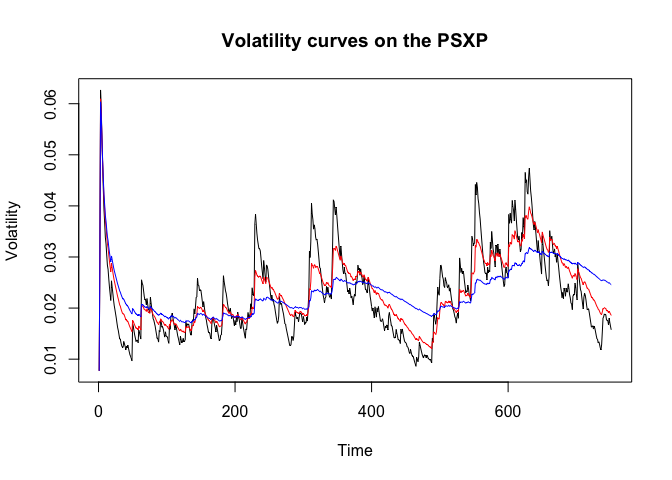

# 2016-0509 MSDS 6304-401 9.5 Perparing Financial BLT Assignment
Bill Kerneckel  
July 13, 2016  

<br>

#### Assignment


You will be assigned to find a series that is less volatile than the S&P 500, the other half a series that is more volatile.

The assigned series is <strong><u>Phillip's 66 Partners (PSXP)</u></strong>.

1. Download the data.
2. Calculate log returns.
3. Calculate volatility measure.
4. Calculate volatility over entire length of series for various three different decay factors.
5. Plot the results, overlaying the volatility curves on the data, just as was done in the S&P example.9

<br>

#### Deliverable


1. Upload the Markdown file containing your code, analysis, and discussion to GitHub. Post a link to the Markdown file in the space below.
2. The markdown document should have code for entering the data, calculating log returns, calculating volatility measure, and calculating     volatility for the entire series using three different decay factors.
3. Also needs to have code for a plot (and the plot itself) with the data and volatility overlaid.
4. The discussion board will talk about the differences in the volatility plots for different stocks.


****************************

#### Setting your working directory.

In order for the analysis of financial data you must set your working directory to the following:


```r
setwd("/Users/wkerneck/desktop/9.5 Perparing Financial Data/")
```

****************************

#### Libraries needed to perform financial analysis.


```r
library(tseries)
library(TTR)
```

****************************

#### 1. Fetch stock information for the S&P500


```r
SNPdata <- get.hist.quote('^gspc',quote="Close")
```

```
## time series ends   2016-07-15
```

****************************

#### 2. Calculate log returns on S&P500

Create log returns for 250 stock trading days. 


```r
SNPret <- log(lag(SNPdata)) - log(SNPdata)
SNPvol <- sd(SNPret) * sqrt(250) * 100
```

Create a volatility measure with a continous lookback window. 


```r
Vol <- function(d, logrets) {
  var = 0
  lam = 0
  varlist <- c()
  for (r in logrets) {
    lam = lam*(1 - 1/d) + 1
  var = (1 - 1/lam) * var + (1/lam) * r^2
    varlist <- c(varlist, var)
  }
  sqrt(varlist)}
```

This is estimate on volatility of the S&P500. The volatility is the degree of variation of a trading price series over time. So this is a measurement that looks at the high peaks in realtion to the spike in S&P500 trades for a specified time period. The time decays used the comparision will be: 10, 30 and 100 days.


```r
volest <- Vol(10,SNPret)
volest2 <- Vol(30,SNPret)
volest3 <- Vol(100,SNPret)
```

****************************

#### 3. Next we will plot S&P500 to show all the decay factors.


```r
plot(volest, type="l", main="Volatility curves on S&P500", xlab = "Time", ylab = "Volatility")
lines(volest2, type="l", col="red")
lines(volest3,type="l", col="blue")
```

<!-- -->


****************************

### Comparison

****************************

#### 1. Fetch stock data for Phillip's 66 Partners (PSXP)


```r
PSXPdata <- get.hist.quote('psxp',quote="Close")
```

```
## time series starts 2013-07-23
## time series ends   2016-07-15
```

****************************

#### 2. Calculate log returns on Phillip's 66 Partners (PSXP)

Create log returns for 250 stock trading days. 


```r
PSXPret <- log(lag(PSXPdata)) - log(PSXPdata)
PSXPvol <- sd(PSXPret) * sqrt(250) * 100
```

Create a volatility measure with a continous lookback window. 


```r
Vol <- function(d, logrets) {
  var = 0
  lam = 0
  varlist <- c()
  for (r in logrets) {
    lam = lam*(1 - 1/d) + 1
  var = (1 - 1/lam) * var + (1/lam) * r^2
    varlist <- c(varlist, var)
  }
  sqrt(varlist)}
```

This is estimate on volatility of the PSXP. The volatility is the degree of variation of a trading price series over time. So this is a measurement that looks at the high peaks in realtion to the spike in PSXP trades for a specified time period. The time decays used the comparision will be: 10, 30 and 100 days.


```r
Pvolest <- Vol(10,PSXPret)
Pvolest2 <- Vol(30,PSXPret)
Pvolest3 <- Vol(100,PSXPret)
```

****************************

#### 3. Next we will plot PSXP to show all the decay factors.


```r
plot(Pvolest, type="l", main="Volatility curves on the PSXP", xlab = "Time", ylab = "Volatility")
lines(Pvolest2, type="l", col="red")
lines(Pvolest3, type="l", col="blue")
```

<!-- -->

